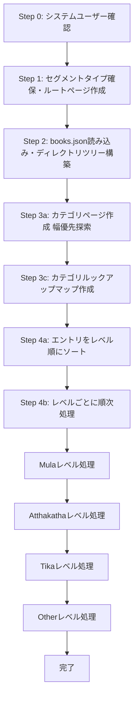

# Tipitaka インポート処理の解説

このドキュメントでは、TipitakaのXMLファイルからMarkdownファイルを経由してデータベースにインポートする処理の全体像と詳細な流れを説明します。

## 目次

- [概要](#概要)
- [処理の全体フロー](#処理の全体フロー)
- [各ステップの詳細](#各ステップの詳細)
- [データ構造](#データ構造)
- [依存関係と順序制約](#依存関係と順序制約)
- [並列処理とパフォーマンス](#並列処理とパフォーマンス)

## 概要

Tipitakaインポート処理は、以下のような流れで実行されます：

1. **前準備**: システムユーザーとセグメントタイプの確認・作成
2. **メタデータ読み込み**: `books.json`から各ファイルのメタデータを取得
3. **ディレクトリ構造の構築**: ファイルの配置に基づいて階層構造を作成
4. **カテゴリページの作成**: 中間ディレクトリに対応するページを作成
5. **コンテンツページの作成**: 各Markdownファイルをページとしてインポート
6. **リンクの作成**: 注釈書（Atthakatha/Tika）と根本経典（Mula）の間で段落番号ベースのリンクを作成

## 処理の全体フロー



## 各ステップの詳細

### Step 0: システムユーザーの確認

**ファイル**: `run.ts` (93-101行目)

```93:101:scripts/tipitaka-import/run.ts
		// Step 0: 取り込み先となるシステムユーザ（evame）が存在するか確認する
		const user = await prisma.user.findUnique({
			where: { handle: SYSTEM_USER_HANDLE },
		});
		if (!user) {
			throw new Error(
				`User with handle ${SYSTEM_USER_HANDLE} not found. Create user first.`,
			);
		}
```

**処理内容**:
- ハンドル `"evame"` のシステムユーザーが存在するか確認
- 存在しない場合はエラーをスロー

**目的**: すべてのTipitakaページの所有者となるシステムユーザーを確保

---

### Step 1: セグメントタイプ・メタデータタイプの確保とルートページの作成

**ファイル**: `run.ts` (19-21行目), `db/segment-types.ts`, `db/metadata-types.ts`, `initial-setup/root-page.ts`

```19:21:scripts/tipitaka-import/run.ts
		// Step 1: セグメントタイプ、メタデータタイプ、ルートページの初期セットアップ
		const { primarySegmentType, commentarySegmentTypeIdByLabel, rootPage } =
			await setupInitialRequirements(user.id);
```

**処理内容**:

1. **セグメントタイプの確保** (`db/segment-types.ts`):
   - 以下の4種類のセグメントタイプを作成:
     - `{ key: "PRIMARY", label: "Mula" }`
     - `{ key: "COMMENTARY", label: "Atthakatha" }`
     - `{ key: "COMMENTARY", label: "Tika" }`
     - `{ key: "PRIMARY", label: "Other" }`
   - `label`ベースと`key`ベースの両方のマッピングを作成
   - コンテンツページ作成時は`label`ベースのマッピングを使用（例: `"Mula"` → `segmentTypeId`）

2. **メタデータタイプの確保** (`db/metadata-types.ts`):
   - ページブレークなどのメタデータタイプを作成:
     - `VRI_PAGEBREAK`, `PTS_PAGEBREAK`, `THAI_PAGEBREAK`, `MYANMAR_PAGEBREAK`, `OTHER_PAGEBREAK`

3. **ルートページの作成** (`initial-setup/root-page.ts`):
   - スラグ `"tipitaka"` のルートページを作成または更新
   - `README.md`の内容をMarkdownとして読み込み、MDAST形式に変換
   - セグメントを同期

**目的**: 
- コンテンツの分類に必要なセグメントタイプとメタデータタイプを準備
- Tipitaka全体のルートとなるページを確保

---

### Step 2: books.jsonの読み込みとディレクトリツリーの構築

**ファイル**: `run.ts` (127-130行目), `books.ts`, `directory-tree.ts`

```127:130:scripts/tipitaka-import/run.ts
		// Step 2: books.json から各ファイルのメタデータを取得し、ディレクトリツリーを作る
		const { entries } = await readBooksJson();
		const directoryRoot = buildDirectoryTree(entries, ROOT_TITLE);
		directoryRoot.pageId = rootPage.id;
```

**処理内容**:

1. **books.jsonの読み込み** (`books.ts`):
   - `scripts/convert-romn-to-md/data/books.json` を読み込み
   - 各ファイルのメタデータ（レベル、ディレクトリパス、関連するMulaファイルなど）を取得
   - `books.json`には既に各エントリに`dirSegments`配列として階層構造が含まれている（例: `["01-tipitaka-mula", "01-sutta-pitaka", "01-digha-nikaya"]`）

2. **ディレクトリツリーの構築** (`directory-tree.ts`):
   - 各エントリの `dirSegments` を走査して、重複するパスを統合したツリー構造を構築
   - 例：`s0101m.mul.xml`と`s0102m.mul.xml`の両方が`["01-tipitaka-mula", "01-sutta-pitaka", "01-digha-nikaya"]`を持っている場合、このパスに対応するカテゴリページは1つだけ作成する必要があるため、ツリーを構築して重複を排除
   - セグメント名から順序とタイトルを抽出（例: `"01-tipitaka-mula"` → order: 1, title: "Tipitaka Mula"）

**データ構造**:
```typescript
interface ImportEntry {
  fileKey: string;              // ファイルキー（例: "s0101m.mul.xml", "s0101a.att.xml"）
  level: string;                // "Mula" | "Atthakatha" | "Tika" | "Other"
  dirSegments: string[];        // ディレクトリセグメント（例: ["01-tipitaka-mula", "01-sutta-pitaka", "01-digha-nikaya"]）
  mulaFileKey: string | null;   // 関連するMulaファイルのキー（例: "s0101a.att.xml" → "s0101m.mul.xml", Mulaファイルの場合は null）
}
```

**具体例**:
- Mulaファイル (`s0101m.mul.xml`):
  - `fileKey`: `"s0101m.mul.xml"`（ファイル名から順序101を抽出可能）
  - `level`: `"Mula"`
  - `dirSegments`: `["01-tipitaka-mula", "01-sutta-pitaka", "01-digha-nikaya", "01-silakkhandhavaggapali"]`
  - `mulaFileKey`: `null`

- Atthakathaファイル (`s0101a.att.xml`):
  - `fileKey`: `"s0101a.att.xml"`（ファイル名から順序101を抽出可能）
  - `level`: `"Atthakatha"`
  - `dirSegments`: `["02-atthakatha", "01-sutta-pitaka-atthakatha", "01-digha-nikaya-atthakatha", "01-silakkhandhavagga-atthakatha"]`
  - `mulaFileKey`: `"s0101m.mul.xml"`

- Tikaファイル (`s0101t.tik.xml`):
  - `fileKey`: `"s0101t.tik.xml"`（ファイル名から順序101を抽出可能）
  - `level`: `"Tika"`
  - `dirSegments`: `["03-tika", "01-sutta-pitaka-tika", "01-digha-nikaya-tika", "01-silakkhandhavagga-tika"]`
  - `mulaFileKey`: `"s0101m.mul.xml"`（Mulaに対する注釈）
  
  **TikaとAtthakathaの関係**:
  - `books.json`では、`s0101t.tik.xml`は`atthakathaIndices: [61]`を持っています
  - インデックス61は`s0101a.att.xml`（Atthakatha）に対応します
  - つまり、Tikaは**MulaとAtthakathaの両方に対する注釈**です
  - 現在のコードでは`mulaFileKey`のみを使用し、Mulaへのリンクのみを作成しています

**目的**: 
- ファイルの階層構造を把握
- 後続の処理でカテゴリページを作成するための基盤を準備

---

### Step 3a: カテゴリページの作成（幅優先探索）

**ファイル**: `run.ts` (132-166行目), `pages.ts`

```132:166:scripts/tipitaka-import/run.ts
		// Step 3a: 幅優先でカテゴリ階層（中間ページ）を作成していく
		const queue: Array<{
			node: DirectoryNode;
			parentId: number;
			path: string;
		}> = [];
		for (const child of getSortedChildren(directoryRoot)) {
			const path = child.segment;
			queue.push({ node: child, parentId: rootPage.id, path });
		}

		const nextDirectoryOrder = getOrderGenerator();

		for (const item of queue) {
			const { node, parentId, path } = item;
			if (node.children.size === 0) {
				continue;
			}
			const order = nextDirectoryOrder(parentId);
		await createDirectoryPage({
			prisma,
			node,
			dirPath: path,
			parentId,
			userId: user.id,
			order,
			segmentTypeId: primaryTypeId,
		});
			for (const child of getSortedChildren(node)) {
				if (node.pageId) {
					const childPath = path ? `${path}/${child.segment}` : child.segment;
					queue.push({ node: child, parentId: node.pageId, path: childPath });
				}
			}
		}
```

**処理内容**:

1. **幅優先探索（BFS: Breadth-First Search）**:
   - ツリー構造を探索するアルゴリズムで、階層の浅い順（同じレベルのノードを先に）に処理する
   - 深さ優先探索（DFS）と対比される：DFSは1つの枝を最後まで探索してから次の枝へ、BFSは同じ階層を全て処理してから次の階層へ
   - キュー（queue）を使用して順次処理
   
   **具体例**:
   ```
   階層構造:
   tipitaka (ルート)
   ├── 01-tipitaka-mula (レベル1)
   │   ├── 01-sutta-pitaka (レベル2)
   │   │   └── 01-digha-nikaya (レベル3)
   │   └── 02-vinaya-pitaka (レベル2)
   └── 02-atthakatha (レベル1)
       └── 01-sutta-pitaka-atthakatha (レベル2)
   
   幅優先探索の処理順序:
   1. 01-tipitaka-mula (レベル1)
   2. 02-atthakatha (レベル1)
   3. 01-sutta-pitaka (レベル2)
   4. 02-vinaya-pitaka (レベル2)
   5. 01-sutta-pitaka-atthakatha (レベル2)
   6. 01-digha-nikaya (レベル3)
   ```
   
   この順序で処理することで、親ページが先に作成され、子ページは親の`pageId`を参照できる

2. **カテゴリページの作成** (`pages.ts`):
   - **データソース**: `DirectoryNode`ツリー（`buildDirectoryTree`で`books.json`の`dirSegments`から構築）
   - **作成条件**: 子ノードが存在する場合のみ作成（`node.children.size > 0`）
   - 各ディレクトリノード（`DirectoryNode`）から以下の情報を取得：
     - `node.title`: `parseSegmentLabel`で`dirSegments`から抽出したタイトル（例: `"01-tipitaka-mula"` → `"Tipitaka Mula"`）
     - `node.segment`: セグメント名（例: `"01-tipitaka-mula"`）
     - `dirPath`: パス文字列（例: `"01-tipitaka-mula/01-sutta-pitaka"`）
   - スラグは `tipitaka-{dirPath}` の形式で生成
   - タイトル（`node.title`）のみのMarkdownをMDAST形式に変換
   - セグメントを同期（タイトルがセグメントとして登録される）
   
   **データフロー**:
   ```
   books.json の dirSegments
   ↓
   ["01-tipitaka-mula", "01-sutta-pitaka", "01-digha-nikaya"]
   ↓
   buildDirectoryTree() で DirectoryNode ツリーに変換
   ↓
   DirectoryNode {
     segment: "01-tipitaka-mula",
     title: "Tipitaka Mula",  // parseSegmentLabel() で抽出
     order: 1,
     children: Map { ... }
   }
   ↓
   createDirectoryPage() でカテゴリページを作成
   - slug: "tipitaka-01-tipitaka-mula"
   - title: "Tipitaka Mula"
   ```

3. **順序の管理**:
   - 親ページごとに独立した順序カウンターを使用
   - `getOrderGenerator()` で親IDごとの順序を管理

**目的**: 
- コンテンツページの親となるカテゴリページを事前に作成
- 階層構造をデータベースに反映

---

### Step 3c: カテゴリルックアップマップの作成

**ファイル**: `run.ts` (168-170行目)

```168:170:scripts/tipitaka-import/run.ts
		// Step 3c: 生成したカテゴリ階層を素早く引き当てられるようにマッピングする
		const categoryLookup = createCategoryLookup(directoryRoot, rootPage);
		const orderForParent = getOrderGenerator();
		const sortedEntries = sortEntries(entries);
```

**処理内容**:
- ディレクトリパス（例: `"01-tipitaka-mula/01-sutta-pitaka"`）からページIDへのマッピングを作成
- 後続の処理で高速に親ページIDを取得するため
- 親ページごとの順序カウンターを初期化

**目的**: コンテンツページ作成時に親ページを素早く特定

---

### Step 4a: エントリのソート

**ファイル**: `run.ts` (20-46行目, 171行目)

```20:46:scripts/tipitaka-import/run.ts
/**
 * fileKeyから順序を抽出する（例: "s0101m.mul.xml" → 101）
 */
function extractOrderFromFileKey(fileKey: string): number {
	const match = fileKey.match(/\d+/);
	if (!match) return Number.MAX_SAFE_INTEGER;
	return Number.parseInt(match[0], 10);
}

// Step 4a: ムーラ → アッタカタ → ティカ → その他の順に並べ、親データを先に作成できるようにする
function sortEntries(entries: ImportEntry[]): ImportEntry[] {
	const levelOrder: Record<ImportEntry["level"], number> = {
		Mula: 0,
		Atthakatha: 1,
		Tika: 2,
		Other: 3,
	};

	return [...entries].sort((a, b) => {
		const levelDiff = levelOrder[a.level] - levelOrder[b.level];
		if (levelDiff !== 0) return levelDiff;
		const orderA = extractOrderFromFileKey(a.fileKey);
		const orderB = extractOrderFromFileKey(b.fileKey);
		if (orderA !== orderB) return orderA - orderB;
		return a.fileKey.localeCompare(b.fileKey);
	});
}
```

**処理内容**:
- レベル順（Mula → Atthakatha → Tika → Other）にソート
- 同じレベル内では `fileKey` から抽出した順序（数字部分）でソート、さらにファイルキーでソート

**目的**: 依存関係を保証（Mulaが先に作成されることで、Atthakatha/Tikaが参照できる）

---

### Step 4b: レベルごとの順次処理と並列処理

**ファイル**: `run.ts` (178-293行目)

```178:293:scripts/tipitaka-import/run.ts
		// エントリをレベルごとにグループ化
		const entriesByLevel = new Map<ImportEntry["level"], ImportEntry[]>();
		for (const entry of sortedEntries) {
			const level = entry.level;
			const levelEntries = entriesByLevel.get(level);
			if (levelEntries) {
				levelEntries.push(entry);
			} else {
				entriesByLevel.set(level, [entry]);
			}
		}

		// レベルごとに順次処理（依存関係を保証）、レベル内では並列処理
		// Mula → Atthakatha → Tika → Other の順で処理することで、
		// 注釈書が参照するムーラのアンカーセグメントが確実に存在することを保証
		const levelOrder: ImportEntry["level"][] = [
			"Mula",
			"Atthakatha",
			"Tika",
			"Other",
		];
		const CONCURRENCY = 10; // 同時処理数

		// Mulaファイルの段落番号 → アンカーセグメントIDのマッピングを保存
		const anchorMapByMulaFile = new Map<string, ParagraphAnchorMap>();

		for (const level of levelOrder) {
			const levelEntries = entriesByLevel.get(level);
			if (!levelEntries || levelEntries.length === 0) continue;

			console.log(`Processing ${level} level: ${levelEntries.length} entries`);

			// バッチで並列処理
			for (let i = 0; i < levelEntries.length; i += CONCURRENCY) {
				const batch = levelEntries.slice(i, i + CONCURRENCY);
				await Promise.all(
					batch.map(async (entry) => {
						const directorySegments = entry.dirSegments.slice(0, -1);
						const parentPageId = resolveCategoryPageId(
							directorySegments,
							categoryLookup,
						);
						const order = orderForParent(parentPageId);
						const levelKey = entry.level?.toUpperCase?.() ?? "";
						// levelKey（"MULA", "ATTHAKATHA"など）からlabelを取得
						// levelKeyは大文字、labelは先頭大文字（"Mula", "Atthakatha"など）
						const label = levelKey.charAt(0) + levelKey.slice(1).toLowerCase();
						const segmentTypeId =
							segmentTypeIdByLabel.get(label) ?? otherTypeId;

						const pageId = await createContentPage({
							prisma,
							entry,
							parentId: parentPageId,
							userId: user.id,
							order,
							segmentTypeId,
						});

					// 段落番号でセグメントをグループ化
					// page.id === content.id なので、pageIdをそのままcontentIdとして使用
					const segments = await getSegmentsForContent(prisma, pageId);
					const paragraphNumberToSegmentIds = buildParagraphSegmentMap(
						segments,
					);
						if (paragraphNumberToSegmentIds.size === 0) {
							return;
						}

						// Mula（根本経典）の場合: アンカーセグメントを特定して保存
						if (levelKey === "MULA") {
						const anchorMap = buildParagraphAnchorMap(
							paragraphNumberToSegmentIds,
							segments,
						);
							// 注釈書で参照できるようにマッピングを保存
							anchorMapByMulaFile.set(entry.fileKey.toLowerCase(), anchorMap);
							return;
						}

						// 注釈書の場合: Mulaのアンカーセグメントにリンク
						if (!entry.mulaFileKey) {
							return;
						}

						const anchorMap = anchorMapByMulaFile.get(
							entry.mulaFileKey.toLowerCase(),
						);
						if (!anchorMap) {
							console.warn(
								`Anchor map not found for mula file: ${entry.mulaFileKey}`,
							);
							return;
						}

						// 同じ段落番号のアンカーセグメントに注釈セグメントをリンク
						for (const [
							paragraphNumber,
							annotationSegmentIds,
						] of paragraphNumberToSegmentIds) {
							const mainSegmentId = anchorMap.get(paragraphNumber);
							if (!mainSegmentId) continue;

							await linkAnnotationSegments(
								prisma,
								annotationSegmentIds,
								mainSegmentId,
							);
						}
					}),
				);
				console.log(
					`  Processed ${Math.min(i + CONCURRENCY, levelEntries.length)}/${levelEntries.length} entries`,
				);
			}
		}
```

**処理内容**:

1. **レベルごとのグループ化**:
   - ソート済みエントリをレベルごとにグループ化

2. **レベルごとの順次処理**:
   - Mula → Atthakatha → Tika → Other の順に処理
   - これにより、Atthakatha/Tikaが参照するMulaが先に作成される

3. **レベル内での並列処理**:
   - 各レベル内では10件ずつバッチ処理で並列実行
   - パフォーマンスを向上

4. **各エントリの処理**:
   - **コンテンツページの作成**: Markdownファイルを読み込み、MDAST形式に変換してページを作成
   - **段落番号マッピングの構築**: セグメントのテキストから段落番号（例: `"123."`）を抽出し、段落番号→セグメントID配列のマッピングを作成
   - **アンカーセグメントの特定とリンク**:
     - **Mula（根本経典）の場合**: 各段落番号について、最大ナンバーのセグメントをアンカーセグメントとして特定し、段落番号→アンカーセグメントIDのマッピングを保存
     - **Atthakatha/Tika（注釈書）の場合**: 対応するMulaファイルのアンカーセグメントを参照し、同じ段落番号を持つ注釈セグメントをアンカーセグメントに直接リンク

**段落番号の抽出** (`segment-annotations.ts` 7-19行目):
```7:19:scripts/tipitaka-import/segment-annotations.ts
/**
 * 段落番号のパターン: 数字にドット（例: "123." または "123\."）
 * エスケープされたドット（\.）にも対応
 */
const PARAGRAPH_NUMBER_REGEX = /(\d+)(?:\.|\\.)/g;

/**
 * セグメントのテキストから最初の段落番号を抽出する
 */
function extractFirstParagraphNumber(text: string): string | null {
	PARAGRAPH_NUMBER_REGEX.lastIndex = 0;
	const match = PARAGRAPH_NUMBER_REGEX.exec(text);
	if (match?.[1]) {
		return match[1];
	}
	return null;
}
```

**段落番号マッピングの構築** (`segment-annotations.ts` 43-82行目):
```43:82:scripts/tipitaka-import/segment-annotations.ts
/**
 * コンテンツ内のセグメントを段落番号でグループ化する
 *
 * セグメントのテキストから段落番号を抽出し、
 * その段落番号が出現してから次の段落番号が出現するまでの
 * すべてのセグメントを同じグループに分類する。
 *
 * @param segments セグメント配列（id, number, text）
 * @returns 段落番号 → セグメントID配列のマッピング
 */
export function buildParagraphSegmentMap(
	segments: SegmentRecord[],
): ParagraphSegmentMap {
	// セグメントID → 段落番号のマッピングを作成
	const paragraphNumberBySegmentId = new Map<number, string>();
	for (const segment of segments) {
		const paragraphNumber = extractFirstParagraphNumber(segment.text);
		if (paragraphNumber) {
			paragraphNumberBySegmentId.set(segment.id, paragraphNumber);
		}
	}

	const paragraphNumberToSegmentIds: ParagraphSegmentMap = new Map();
	let currentParagraphNumber: string | null = null;

	// セグメントを順番に処理し、段落番号でグループ化
	// 段落番号が出現したらそれを現在の段落番号として保持し、
	// 次の段落番号が出現するまで同じグループに分類する
	for (const segment of segments) {
		const paragraphNumber = paragraphNumberBySegmentId.get(segment.id) ?? null;
		if (paragraphNumber) {
			currentParagraphNumber = paragraphNumber;
		}
		if (!currentParagraphNumber) continue;

		const segmentIds =
			paragraphNumberToSegmentIds.get(currentParagraphNumber) ?? [];
		segmentIds.push(segment.id);
		paragraphNumberToSegmentIds.set(currentParagraphNumber, segmentIds);
	}

	return paragraphNumberToSegmentIds;
}
```

**アンカーセグメントの特定** (`segment-annotations.ts` 84-115行目):
```84:115:scripts/tipitaka-import/segment-annotations.ts
/**
 * 各段落番号について、最大ナンバーのセグメント（アンカーセグメント）を特定する
 *
 * @param paragraphNumberToSegmentIds 段落番号 → セグメントID配列のマッピング
 * @param segments セグメント配列（id, number, text）
 * @returns 段落番号 → アンカーセグメントIDのマッピング
 */
export function buildParagraphAnchorMap(
	paragraphNumberToSegmentIds: ParagraphSegmentMap,
	segments: SegmentRecord[],
): ParagraphAnchorMap {
	const anchorMap: ParagraphAnchorMap = new Map();
	const segmentNumberById = new Map<number, number>();
	for (const segment of segments) {
		segmentNumberById.set(segment.id, segment.number);
	}

	for (const [paragraphNumber, segmentIds] of paragraphNumberToSegmentIds) {
		if (segmentIds.length === 0) continue;

		// 最大ナンバーのセグメントをアンカーとして選択
		const anchorSegmentId = segmentIds.reduce((maxId, currentId) => {
			const maxNumber = segmentNumberById.get(maxId) ?? -Infinity;
			const currentNumber = segmentNumberById.get(currentId) ?? -Infinity;
			return currentNumber > maxNumber ? currentId : maxId;
		});

		anchorMap.set(paragraphNumber, anchorSegmentId);
	}

	return anchorMap;
}
```

**アノテーションリンクの作成** (`segment-annotations.ts` 117-140行目):
```117:140:scripts/tipitaka-import/segment-annotations.ts
/**
 * 注釈セグメントを本文セグメントに直接リンクする
 *
 * @param prisma Prismaクライアント
 * @param annotationSegmentIds 注釈セグメントID配列
 * @param mainSegmentId 本文セグメントID（アンカー）
 */
export async function linkAnnotationSegments(
	prisma: PrismaClient,
	annotationSegmentIds: number[],
	mainSegmentId: number,
): Promise<void> {
	if (annotationSegmentIds.length === 0) return;

	const linkData = annotationSegmentIds.map((annotationSegmentId) => ({
		mainSegmentId,
		annotationSegmentId,
	}));

	await prisma.segmentAnnotationLink.createMany({
		data: linkData,
		skipDuplicates: true,
	});
}
```

**目的**: 
- コンテンツページをデータベースにインポート
- ムーラ（根本経典）で各段落番号のアンカーセグメントを特定
- 注釈書（Atthakatha/Tika）のセグメントを根本経典のアンカーセグメントに直接リンク

**アノテーションリンクシステムの仕組み**:
- **アンカーセグメント**: 各段落番号について、最大ナンバーのセグメントをアンカーとして選択（段落の終わりを表す）
- **SegmentAnnotationLink**: 注釈セグメントと本文セグメント（アンカー）の多対多の関係
- ムーラで特定されたアンカーセグメントに注釈書のセグメントをリンクすることで、注釈と本文を結びつける

---

## データ構造

### ImportEntry

各ファイルのメタデータを表す:

```typescript
interface ImportEntry {
  fileKey: string;              // ファイルキー（例: "s0101m.mul.xml", "s0101a.att.xml"）
  level: string;                // "Mula" | "Atthakatha" | "Tika" | "Other"
  dirSegments: string[];        // ディレクトリセグメント（例: ["01-tipitaka-mula", "01-sutta-pitaka", "01-digha-nikaya"]）
  mulaFileKey: string | null;   // 関連するMulaファイルのキー（例: "s0101a.att.xml" → "s0101m.mul.xml", Mulaファイルの場合は null）
}
```

**具体例**:
- Mulaファイル (`s0101m.mul.xml`):
  - `fileKey`: `"s0101m.mul.xml"`（ファイル名から順序101を抽出可能）
  - `level`: `"Mula"`
  - `dirSegments`: `["01-tipitaka-mula", "01-sutta-pitaka", "01-digha-nikaya", "01-silakkhandhavaggapali"]`
  - `mulaFileKey`: `null`

- Atthakathaファイル (`s0101a.att.xml`):
  - `fileKey`: `"s0101a.att.xml"`（ファイル名から順序101を抽出可能）
  - `level`: `"Atthakatha"`
  - `dirSegments`: `["02-atthakatha", "01-sutta-pitaka-atthakatha", "01-digha-nikaya-atthakatha", "01-silakkhandhavagga-atthakatha"]`
  - `mulaFileKey`: `"s0101m.mul.xml"`

- Tikaファイル (`s0101t.tik.xml`):
  - `fileKey`: `"s0101t.tik.xml"`（ファイル名から順序101を抽出可能）
  - `level`: `"Tika"`
  - `dirSegments`: `["03-tika", "01-sutta-pitaka-tika", "01-digha-nikaya-tika", "01-silakkhandhavagga-tika"]`
  - `mulaFileKey`: `"s0101m.mul.xml"`（Mulaに対する注釈）
  
  **TikaとAtthakathaの関係**:
  - `books.json`では、`s0101t.tik.xml`は`atthakathaIndices: [61]`を持っています
  - インデックス61は`s0101a.att.xml`（Atthakatha）に対応します
  - つまり、Tikaは**MulaとAtthakathaの両方に対する注釈**です
  - 現在のコードでは`mulaFileKey`のみを使用し、Mulaへのリンクのみを作成しています

### DirectoryNode

ディレクトリ階層を表す:

```typescript
interface DirectoryNode {
  segment: string;                    // セグメント名（例: "1-vinaya"）
  title: string;                      // 表示タイトル（例: "Vinaya"）
  order: number;                      // 順序（例: 1）
  children: Map<string, DirectoryNode>; // 子ノード
  pageId?: number;                    // 作成されたページID
}
```

## 依存関係と順序制約

### レベル間の依存関係

1. **Mula（根本経典）**: 他のレベルに依存しない
2. **Atthakatha（注釈書）**: Mulaに依存（段落番号でリンク）
3. **Tika（注釈書の注釈書）**: AtthakathaとMulaに依存
4. **Other**: 依存関係なし

### 処理順序の重要性

- Mulaが先に処理されることで、Atthakatha/Tikaが参照するMulaの段落番号マッピングが利用可能になる
- レベルごとの順次処理により、依存関係が保証される

## 並列処理とパフォーマンス

### 並列処理の戦略

1. **レベル間**: 順次処理（依存関係を保証）
2. **レベル内**: 10件ずつバッチで並列処理
3. **カテゴリページ**: 幅優先探索で順次処理（親子関係を保証）

### パフォーマンス最適化

- **バッチ処理**: 10件ずつ並列処理することで、データベースへの負荷を分散
- **ルックアップマップ**: カテゴリページIDの高速検索
- **トランザクション**: 各ページ作成はトランザクション内で実行（60秒タイムアウト）

## 関連ファイル

- `run.ts`: メインのインポート処理
- `books.ts`: books.jsonの読み込みとエントリの生成
- `directory-tree.ts`: ディレクトリツリーの構築
- `pages.ts`: ページ作成処理（カテゴリページ・コンテンツページ）
- `helpers.ts`: ユーティリティ関数
- `db/segment-types.ts`: セグメントタイプの管理
- `db/metadata-types.ts`: メタデータタイプの管理
- `segment-annotations.ts`: 段落番号ベースのアンカーセグメント特定とアノテーションリンク処理
- `initial-setup/root-page.ts`: ルートページの作成
- `types.ts`: 型定義
- `constants.ts`: 定数定義
