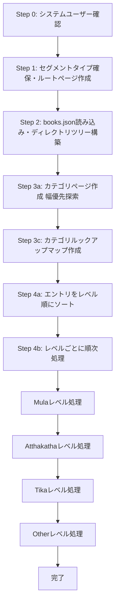

# Tipitaka インポート処理の解説

このドキュメントでは、TipitakaのXMLファイルからMarkdownファイルを経由してデータベースにインポートする処理の全体像と詳細な流れを説明します。

## 目次

- [概要](#概要)
- [処理の全体フロー](#処理の全体フロー)
- [各ステップの詳細](#各ステップの詳細)
- [データ構造](#データ構造)
- [依存関係と順序制約](#依存関係と順序制約)
- [並列処理とパフォーマンス](#並列処理とパフォーマンス)

## 概要

Tipitakaインポート処理は、以下のような流れで実行されます：

1. **前準備**: システムユーザーとセグメントタイプの確認・作成
2. **メタデータ読み込み**: `books.json`から各ファイルのメタデータを取得
3. **ディレクトリ構造の構築**: ファイルの配置に基づいて階層構造を作成
4. **カテゴリページの作成**: 中間ディレクトリに対応するページを作成
5. **コンテンツページの作成**: 各Markdownファイルをページとしてインポート
6. **リンクの作成**: 注釈書（Atthakatha/Tika）と根本経典（Mula）の間で段落番号ベースのリンクを作成

## 処理の全体フロー



## 各ステップの詳細

### Step 0: システムユーザーの確認

**ファイル**: `run.ts` (57-69行目)

```57:69:scripts/tipitaka-import/run.ts
export async function runTipitakaImport(): Promise<void> {
	const prisma = new PrismaClient();

	try {
		// Step 0: 取り込み先となるシステムユーザ（evame）が存在するか確認する
		const user = await prisma.user.findUnique({
			where: { handle: SYSTEM_USER_HANDLE },
		});
		if (!user) {
			throw new Error(
				`User with handle ${SYSTEM_USER_HANDLE} not found. Create user first.`,
			);
		}
```

**処理内容**:
- ハンドル `"evame"` のシステムユーザーが存在するか確認
- 存在しない場合はエラーをスロー

**目的**: すべてのTipitakaページの所有者となるシステムユーザーを確保

---

### Step 1: セグメントタイプの確保とルートページの作成

**ファイル**: `run.ts` (71-81行目), `segment-types.ts`, `root-page.ts`

```71:81:scripts/tipitaka-import/run.ts
		// Step 1: セグメント種別を upsert し、ルートページも最新状態にそろえる
		const segmentTypes = await ensureSegmentTypes(prisma);
		const segmentTypeIdMap = new Map(
			segmentTypes.map((item) => [item.key as SegmentType["key"], item.id]),
		);
		const primaryTypeId = segmentTypeIdMap.get("PRIMARY");
		if (!primaryTypeId) {
			throw new Error('Segment type "PRIMARY" not found');
		}

		const rootPage = await ensureRootPage(prisma, user.id, primaryTypeId);
```

**処理内容**:

1. **セグメントタイプの確保** (`segment-types.ts`):
   - `MULA`, `ATTHAKATHA`, `TIKA`, `OTHER` の4種類のセグメントタイプを作成
   - 各タイプには重み（weight）が設定され、表示順序を制御

2. **ルートページの作成** (`root-page.ts`):
   - スラグ `"tipitaka"` のルートページを作成または更新
   - `README.md`の内容をMarkdownとして読み込み、MDAST形式に変換
   - セグメントを同期

**目的**: 
- コンテンツの分類に必要なセグメントタイプを準備
- Tipitaka全体のルートとなるページを確保

---

### Step 2: books.jsonの読み込みとディレクトリツリーの構築

**ファイル**: `run.ts` (83-86行目), `books.ts`, `directory-tree.ts`

```83:86:scripts/tipitaka-import/run.ts
		// Step 2: books.json から各ファイルのメタデータを取得し、ディレクトリツリーを作る
		const { entries } = await readBooksJson();
		const directoryRoot = buildDirectoryTree(entries, ROOT_TITLE);
		directoryRoot.pageId = rootPage.id;
```

**処理内容**:

1. **books.jsonの読み込み** (`books.ts`):
   - `scripts/convert-romn-to-md/data/books.json` を読み込み
   - 各ファイルのメタデータ（レベル、ディレクトリパス、関連するMulaファイルなど）を取得
   - `books.json`には既に各エントリに`dirSegments`配列として階層構造が含まれている（例: `["01-tipitaka-mula", "01-sutta-pitaka", "01-digha-nikaya"]`）

2. **ディレクトリツリーの構築** (`directory-tree.ts`):
   - 各エントリの `dirSegments` を走査して、重複するパスを統合したツリー構造を構築
   - 例：`s0101m.mul.xml`と`s0102m.mul.xml`の両方が`["01-tipitaka-mula", "01-sutta-pitaka", "01-digha-nikaya"]`を持っている場合、このパスに対応するカテゴリページは1つだけ作成する必要があるため、ツリーを構築して重複を排除
   - セグメント名から順序とタイトルを抽出（例: `"01-tipitaka-mula"` → order: 1, title: "Tipitaka Mula"）

**データ構造**:
```typescript
interface ImportEntry {
  fileKey: string;              // ファイルキー（例: "s0101m.mul.xml", "s0101a.att.xml"）
  level: string;                // "Mula" | "Atthakatha" | "Tika" | "Other"
  dirSegments: string[];        // ディレクトリセグメント（例: ["01-tipitaka-mula", "01-sutta-pitaka", "01-digha-nikaya"]）
  mulaFileKey: string | null;   // 関連するMulaファイルのキー（例: "s0101a.att.xml" → "s0101m.mul.xml", Mulaファイルの場合は null）
}
```

**具体例**:
- Mulaファイル (`s0101m.mul.xml`):
  - `fileKey`: `"s0101m.mul.xml"`（ファイル名から順序101を抽出可能）
  - `level`: `"Mula"`
  - `dirSegments`: `["01-tipitaka-mula", "01-sutta-pitaka", "01-digha-nikaya", "01-silakkhandhavaggapali"]`
  - `mulaFileKey`: `null`

- Atthakathaファイル (`s0101a.att.xml`):
  - `fileKey`: `"s0101a.att.xml"`（ファイル名から順序101を抽出可能）
  - `level`: `"Atthakatha"`
  - `dirSegments`: `["02-atthakatha", "01-sutta-pitaka-atthakatha", "01-digha-nikaya-atthakatha", "01-silakkhandhavagga-atthakatha"]`
  - `mulaFileKey`: `"s0101m.mul.xml"`

- Tikaファイル (`s0101t.tik.xml`):
  - `fileKey`: `"s0101t.tik.xml"`（ファイル名から順序101を抽出可能）
  - `level`: `"Tika"`
  - `dirSegments`: `["03-tika", "01-sutta-pitaka-tika", "01-digha-nikaya-tika", "01-silakkhandhavagga-tika"]`
  - `mulaFileKey`: `"s0101m.mul.xml"`（Mulaに対する注釈）
  
  **TikaとAtthakathaの関係**:
  - `books.json`では、`s0101t.tik.xml`は`atthakathaIndices: [61]`を持っています
  - インデックス61は`s0101a.att.xml`（Atthakatha）に対応します
  - つまり、Tikaは**MulaとAtthakathaの両方に対する注釈**です
  - 現在のコードでは`mulaFileKey`のみを使用し、Mulaへのリンクのみを作成しています

**目的**: 
- ファイルの階層構造を把握
- 後続の処理でカテゴリページを作成するための基盤を準備

---

### Step 3a: カテゴリページの作成（幅優先探索）

**ファイル**: `run.ts` (88-119行目), `pages.ts`

```88:119:scripts/tipitaka-import/run.ts
		// Step 3a: 幅優先でカテゴリ階層（中間ページ）を作成していく
		const queue: Array<{
			node: DirectoryNode;
			parentId: number;
			path: string;
		}> = [];
		for (const child of getSortedChildren(directoryRoot)) {
			const path = child.segment;
			queue.push({ node: child, parentId: rootPage.id, path });
		}

		const nextDirectoryOrder = getOrderGenerator();

		for (const item of queue) {
			const { node, parentId, path } = item;
			const order = nextDirectoryOrder(parentId);
			await createDirectoryPage({
				prisma,
				node,
				directoryPath: path,
				parentId,
				userId: user.id,
				order,
				segmentTypeId: primaryTypeId,
			});
			for (const child of getSortedChildren(node)) {
				if (node.pageId) {
					const childPath = path ? `${path}/${child.segment}` : child.segment;
					queue.push({ node: child, parentId: node.pageId, path: childPath });
				}
			}
		}
```

**処理内容**:

1. **幅優先探索（BFS: Breadth-First Search）**:
   - ツリー構造を探索するアルゴリズムで、階層の浅い順（同じレベルのノードを先に）に処理する
   - 深さ優先探索（DFS）と対比される：DFSは1つの枝を最後まで探索してから次の枝へ、BFSは同じ階層を全て処理してから次の階層へ
   - キュー（queue）を使用して順次処理
   
   **具体例**:
   ```
   階層構造:
   tipitaka (ルート)
   ├── 01-tipitaka-mula (レベル1)
   │   ├── 01-sutta-pitaka (レベル2)
   │   │   └── 01-digha-nikaya (レベル3)
   │   └── 02-vinaya-pitaka (レベル2)
   └── 02-atthakatha (レベル1)
       └── 01-sutta-pitaka-atthakatha (レベル2)
   
   幅優先探索の処理順序:
   1. 01-tipitaka-mula (レベル1)
   2. 02-atthakatha (レベル1)
   3. 01-sutta-pitaka (レベル2)
   4. 02-vinaya-pitaka (レベル2)
   5. 01-sutta-pitaka-atthakatha (レベル2)
   6. 01-digha-nikaya (レベル3)
   ```
   
   この順序で処理することで、親ページが先に作成され、子ページは親の`pageId`を参照できる

2. **カテゴリページの作成** (`pages.ts`):
   - **データソース**: `DirectoryNode`ツリー（`buildDirectoryTree`で`books.json`の`dirSegments`から構築）
   - 各ディレクトリノード（`DirectoryNode`）から以下の情報を取得：
     - `node.title`: `parseSegmentLabel`で`dirSegments`から抽出したタイトル（例: `"01-tipitaka-mula"` → `"Tipitaka Mula"`）
     - `node.segment`: セグメント名（例: `"01-tipitaka-mula"`）
     - `directoryPath`: パス文字列（例: `"01-tipitaka-mula/01-sutta-pitaka"`）
   - スラグは `tipitaka-{directoryPath}` の形式で生成
   - タイトル（`node.title`）のみのMarkdownをMDAST形式に変換
   - セグメントを同期（タイトルがセグメントとして登録される）
   
   **データフロー**:
   ```
   books.json の dirSegments
   ↓
   ["01-tipitaka-mula", "01-sutta-pitaka", "01-digha-nikaya"]
   ↓
   buildDirectoryTree() で DirectoryNode ツリーに変換
   ↓
   DirectoryNode {
     segment: "01-tipitaka-mula",
     title: "Tipitaka Mula",  // parseSegmentLabel() で抽出
     order: 1,
     children: Map { ... }
   }
   ↓
   createDirectoryPage() でカテゴリページを作成
   - slug: "tipitaka-01-tipitaka-mula"
   - title: "Tipitaka Mula"
   ```

3. **順序の管理**:
   - 親ページごとに独立した順序カウンターを使用
   - `getOrderGenerator()` で親IDごとの順序を管理

**目的**: 
- コンテンツページの親となるカテゴリページを事前に作成
- 階層構造をデータベースに反映

---

### Step 3c: カテゴリルックアップマップの作成

**ファイル**: `run.ts` (121-122行目)

```121:122:scripts/tipitaka-import/run.ts
		// Step 3c: 生成したカテゴリ階層を素早く引き当てられるようにマッピングする
		const categoryLookup = createCategoryLookup(directoryRoot, rootPage);
```

**処理内容**:
- ディレクトリパス（例: `"vinaya/suttavibhanga"`）からページIDへのマッピングを作成
- 後続の処理で高速に親ページIDを取得するため

**目的**: コンテンツページ作成時に親ページを素早く特定

---

### Step 4a: エントリのソート

**ファイル**: `run.ts` (14-28行目, 129行目)

```14:28:scripts/tipitaka-import/run.ts
// Step 4a: ムーラ → アッタカタ → ティカ → その他の順に並べ、親データを先に作成できるようにする
function sortEntries(entries: ImportEntry[]): ImportEntry[] {
	const levelOrder: Record<ImportEntry["level"], number> = {
		Mula: 0,
		Atthakatha: 1,
		Tika: 2,
		Other: 3,
	};

	return [...entries].sort((a, b) => {
		const levelDiff = levelOrder[a.level] - levelOrder[b.level];
		if (levelDiff !== 0) return levelDiff;
		if (a.orderHint !== b.orderHint) return a.orderHint - b.orderHint;
		return a.fileKey.localeCompare(b.fileKey);
	});
}
```

**処理内容**:
- レベル順（Mula → Atthakatha → Tika → Other）にソート
- 同じレベル内では `fileKey` から抽出した順序でソート、さらにファイルキーでソート

**目的**: 依存関係を保証（Mulaが先に作成されることで、Atthakatha/Tikaが参照できる）

---

### Step 4b: レベルごとの順次処理と並列処理

**ファイル**: `run.ts` (136-216行目)

```136:216:scripts/tipitaka-import/run.ts
		// エントリをレベルごとにグループ化
		const entriesByLevel = new Map<ImportEntry["level"], ImportEntry[]>();
		for (const entry of sortedEntries) {
			const level = entry.level;
			const levelEntries = entriesByLevel.get(level);
			if (levelEntries) {
				levelEntries.push(entry);
			} else {
				entriesByLevel.set(level, [entry]);
			}
		}

		// レベルごとに順次処理（依存関係を保証）、レベル内では並列処理
		const levelOrder: ImportEntry["level"][] = [
			"Mula",
			"Atthakatha",
			"Tika",
			"Other",
		];
		const CONCURRENCY = 10; // 同時処理数

		for (const level of levelOrder) {
			const levelEntries = entriesByLevel.get(level);
			if (!levelEntries || levelEntries.length === 0) continue;

			console.log(`Processing ${level} level: ${levelEntries.length} entries`);

			// バッチで並列処理
			for (let i = 0; i < levelEntries.length; i += CONCURRENCY) {
				const batch = levelEntries.slice(i, i + CONCURRENCY);
				await Promise.all(
					batch.map(async (entry) => {
						const parentPageId = resolveCategoryPageId(
							entry.resolvedDirSegments,
							categoryLookup,
						);
						const order = orderForParent(parentPageId);
						const levelKey = entry.level?.toUpperCase?.() ?? "";
						const segmentTypeId =
							segmentTypeIdMap.get(levelKey as SegmentType["key"]) ??
							otherTypeId;

						const pageId = await createContentPage({
							prisma,
							entry,
							parentId: parentPageId,
							userId: user.id,
							order,
							segmentTypeId,
						});

						const paragraphNumberToSegmentIds =
							await buildParagraphNumberToSegmentIdsMap(prisma, pageId);
						paragraphNumberToSegmentIdsByFile.set(
							entry.fileKey.toLowerCase(),
							paragraphNumberToSegmentIds,
						);

						if (
							(levelKey === "ATTHAKATHA" || levelKey === "TIKA") &&
							entry.mulaFileKey
						) {
							const mulaParagraphNumberToSegmentIds =
								paragraphNumberToSegmentIdsByFile.get(
									entry.mulaFileKey.toLowerCase(),
								);
							if (mulaParagraphNumberToSegmentIds) {
								await linkSegmentsByParagraphNumber(
									prisma,
									paragraphNumberToSegmentIds,
									mulaParagraphNumberToSegmentIds,
								);
							}
						}
					}),
				);
				console.log(
					`  Processed ${Math.min(i + CONCURRENCY, levelEntries.length)}/${levelEntries.length} entries`,
				);
			}
		}
```

**処理内容**:

1. **レベルごとのグループ化**:
   - ソート済みエントリをレベルごとにグループ化

2. **レベルごとの順次処理**:
   - Mula → Atthakatha → Tika → Other の順に処理
   - これにより、Atthakatha/Tikaが参照するMulaが先に作成される

3. **レベル内での並列処理**:
   - 各レベル内では10件ずつバッチ処理で並列実行
   - パフォーマンスを向上

4. **各エントリの処理**:
   - **コンテンツページの作成**: Markdownファイルを読み込み、MDAST形式に変換してページを作成
   - **段落番号マッピングの構築**: セグメント内の段落番号（例: `"123."`）を抽出し、段落番号→セグメントIDのマッピングを作成
   - **リンクの作成**: Atthakatha/Tikaの場合、対応するMulaファイルの段落番号マッピングを取得し、同じ段落番号のセグメント間でリンクを作成

**段落番号の抽出** (`run.ts` 222-257行目):
```222:257:scripts/tipitaka-import/run.ts
/**
 * 段落番号のパターン: 数字にドット（例: "123." または "123\."）
 * segment.textからは§記号が削除されているため、数字+ドットのパターンで識別する
 * エスケープされたドット（\.）にも対応
 */
const PARAGRAPH_NUMBER_REGEX = /(\d+)(?:\.|\\.)/g;

/**
 * ページ内の各セグメントから段落番号（数字.）を抽出し、
 * 段落番号 → セグメントIDの配列のマッピングを構築する
 */
async function buildParagraphNumberToSegmentIdsMap(
	prisma: PrismaClient,
	pageId: number,
): Promise<Map<number, number[]>> {
	const segments = await prisma.segment.findMany({
		where: { contentId: pageId },
		select: { id: true, text: true },
	});
	const paragraphNumberToSegmentIds = new Map<number, number[]>();
	for (const segment of segments) {
		PARAGRAPH_NUMBER_REGEX.lastIndex = 0;
		let match: RegExpExecArray | null = PARAGRAPH_NUMBER_REGEX.exec(
			segment.text,
		);
		while (match !== null) {
			const paragraphNumber = Number.parseInt(match[1] ?? "", 10);
			if (!Number.isFinite(paragraphNumber)) continue;
			const segmentIds = paragraphNumberToSegmentIds.get(paragraphNumber) ?? [];
			segmentIds.push(segment.id);
			paragraphNumberToSegmentIds.set(paragraphNumber, segmentIds);
			match = PARAGRAPH_NUMBER_REGEX.exec(segment.text);
		}
	}
	return paragraphNumberToSegmentIds;
}
```

**リンクの作成** (`run.ts` 259-289行目):
```259:289:scripts/tipitaka-import/run.ts
/**
 * 注釈書（Atthakatha/Tika）と根本経典（Mula）の間で、
 * 同じ段落番号を持つセグメント同士をリンクする
 */
async function linkSegmentsByParagraphNumber(
	prisma: PrismaClient,
	commentaryParagraphMap: Map<number, number[]>,
	rootTextParagraphMap: Map<number, number[]>,
) {
	const segmentLinks: { fromSegmentId: number; toSegmentId: number }[] = [];
	for (const [
		paragraphNumber,
		commentarySegmentIds,
	] of commentaryParagraphMap) {
		const rootTextSegmentIds = rootTextParagraphMap.get(paragraphNumber);
		if (!rootTextSegmentIds || rootTextSegmentIds.length === 0) continue;
		for (const commentarySegmentId of commentarySegmentIds) {
			for (const rootTextSegmentId of rootTextSegmentIds) {
				segmentLinks.push({
					fromSegmentId: commentarySegmentId,
					toSegmentId: rootTextSegmentId,
				});
			}
		}
	}
	if (segmentLinks.length === 0) return;
	await prisma.segmentLink.createMany({
		data: segmentLinks,
		skipDuplicates: true,
	});
}
```

**目的**: 
- コンテンツページをデータベースにインポート
- 注釈書と根本経典の間で段落番号ベースのリンクを自動生成

---

## データ構造

### ImportEntry

各ファイルのメタデータを表す:

```typescript
interface ImportEntry {
  fileKey: string;              // ファイルキー（例: "s0101m.mul.xml", "s0101a.att.xml"）
  level: string;                // "Mula" | "Atthakatha" | "Tika" | "Other"
  dirSegments: string[];        // ディレクトリセグメント（例: ["01-tipitaka-mula", "01-sutta-pitaka", "01-digha-nikaya"]）
  mulaFileKey: string | null;   // 関連するMulaファイルのキー（例: "s0101a.att.xml" → "s0101m.mul.xml", Mulaファイルの場合は null）
}
```

**具体例**:
- Mulaファイル (`s0101m.mul.xml`):
  - `fileKey`: `"s0101m.mul.xml"`（ファイル名から順序101を抽出可能）
  - `level`: `"Mula"`
  - `dirSegments`: `["01-tipitaka-mula", "01-sutta-pitaka", "01-digha-nikaya", "01-silakkhandhavaggapali"]`
  - `mulaFileKey`: `null`

- Atthakathaファイル (`s0101a.att.xml`):
  - `fileKey`: `"s0101a.att.xml"`（ファイル名から順序101を抽出可能）
  - `level`: `"Atthakatha"`
  - `dirSegments`: `["02-atthakatha", "01-sutta-pitaka-atthakatha", "01-digha-nikaya-atthakatha", "01-silakkhandhavagga-atthakatha"]`
  - `mulaFileKey`: `"s0101m.mul.xml"`

- Tikaファイル (`s0101t.tik.xml`):
  - `fileKey`: `"s0101t.tik.xml"`（ファイル名から順序101を抽出可能）
  - `level`: `"Tika"`
  - `dirSegments`: `["03-tika", "01-sutta-pitaka-tika", "01-digha-nikaya-tika", "01-silakkhandhavagga-tika"]`
  - `mulaFileKey`: `"s0101m.mul.xml"`（Mulaに対する注釈）
  
  **TikaとAtthakathaの関係**:
  - `books.json`では、`s0101t.tik.xml`は`atthakathaIndices: [61]`を持っています
  - インデックス61は`s0101a.att.xml`（Atthakatha）に対応します
  - つまり、Tikaは**MulaとAtthakathaの両方に対する注釈**です
  - 現在のコードでは`mulaFileKey`のみを使用し、Mulaへのリンクのみを作成しています

### DirectoryNode

ディレクトリ階層を表す:

```typescript
interface DirectoryNode {
  segment: string;                    // セグメント名（例: "1-vinaya"）
  title: string;                      // 表示タイトル（例: "Vinaya"）
  order: number;                      // 順序（例: 1）
  children: Map<string, DirectoryNode>; // 子ノード
  pageId?: number;                    // 作成されたページID
}
```

## 依存関係と順序制約

### レベル間の依存関係

1. **Mula（根本経典）**: 他のレベルに依存しない
2. **Atthakatha（注釈書）**: Mulaに依存（段落番号でリンク）
3. **Tika（注釈書の注釈書）**: AtthakathaとMulaに依存
4. **Other**: 依存関係なし

### 処理順序の重要性

- Mulaが先に処理されることで、Atthakatha/Tikaが参照するMulaの段落番号マッピングが利用可能になる
- レベルごとの順次処理により、依存関係が保証される

## 並列処理とパフォーマンス

### 並列処理の戦略

1. **レベル間**: 順次処理（依存関係を保証）
2. **レベル内**: 10件ずつバッチで並列処理
3. **カテゴリページ**: 幅優先探索で順次処理（親子関係を保証）

### パフォーマンス最適化

- **バッチ処理**: 10件ずつ並列処理することで、データベースへの負荷を分散
- **ルックアップマップ**: カテゴリページIDの高速検索
- **トランザクション**: 各ページ作成はトランザクション内で実行（60秒タイムアウト）

## 関連ファイル

- `run.ts`: メインのインポート処理
- `books.ts`: books.jsonの読み込みとエントリの生成
- `directory-tree.ts`: ディレクトリツリーの構築
- `pages.ts`: ページ作成処理（カテゴリページ・コンテンツページ）
- `helpers.ts`: ユーティリティ関数
- `segment-types.ts`: セグメントタイプの管理
- `root-page.ts`: ルートページの作成
- `types.ts`: 型定義
- `constants.ts`: 定数定義

